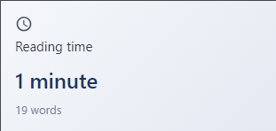

# Reading Time Extension

A lightweight Chrome extension that instantly shows you how long it will take to read any webpage. Clean, simple, and privacy-focused with no tracking or data collection.



## Features

- 📚 Instant reading time calculation
- 🎯 Accurate word counting that excludes navigation, ads, and other non-content elements
- 🎨 Clean, minimal interface
- 🔒 Privacy-focused: works entirely offline with no data collection
- ⚡ Lightweight: no external dependencies
- 📚 Summarize long articles, news, blogs, etc. *Coming soon*

## Installation

### From Chrome Web Store
*Coming soon*

### Manual Installation
1. Download or clone this repository
2. Open Chrome and navigate to `chrome://extensions/`
3. Enable "Developer mode" in the top-right corner
4. Click "Load unpacked" and select the extension directory

## How It Works

The extension uses a sophisticated algorithm to:
1. Strip out non-content elements like navigation, ads, and scripts
2. Calculate the actual word count of the main content
3. Estimate reading time based on an average reading speed of 200 words per minute

## File Structure
```
reading-time/
├── manifest.json
├── popup.html
├── popup.js
├── content.js
└── README.md
```

## Development

Want to contribute? Great! Here's how:

1. Fork the repo
2. Create a new branch (`git checkout -b feature/amazing-feature`)
3. Make your changes
4. Commit your changes (`git commit -m 'Add amazing feature'`)
5. Push to the branch (`git push origin feature/amazing-feature`)
6. Open a Pull Request

## Privacy Policy

This extension:
- Does not collect any user data
- Does not require any special permissions beyond accessing the current tab
- Does not communicate with any external servers
- All calculations are performed locally in your browser

Husnain Khaliq 
